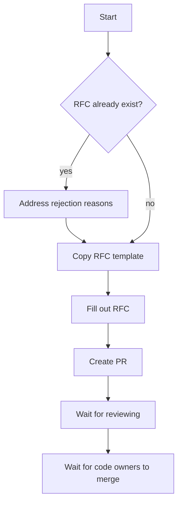

# RFC Process
The RFC process is here for having a structured way of defining rules and making sure new rules are not added before
a proper reviewing process of it has happened.

The "RFC" (request for comments) process is intended to provide a consistent and controlled path for new rules and
changes to enter the standards.

The process follows the following flowchart


## When To Create An RFC
The RFC process is meant for substantial changes. Clarifications on an existing rule or bug fixes does not require an
RFC.  
If there is doubt about the change being an RFC or just a PR, then consider either creating the PR with the change and
await feedback or open an issue detailing the problem.

Sometimes a clarification can result in an RFC, this could be because the clarification is changing the intended purpose
of the original RFC which added the rule. The reviewing process will help to decide this, to not put the burden on the
contributor.

## Creating An RFC
When creating an RFC, the following steps should be followed.

### 1. Check for existing RFC
When creating an RFC, the first step should always be to check if an RFC for the requested change has already been
suggested before. To do this look through closed PR's with the label RFC.
https://github.com/worksome/graphql-standards/labels/RFC

If an RFC was found in this process, read into the reasons it was rejected and address them.

### 2. Fill out the RFC template
When creating an RFC, the template named [`yyyymmdd-template.md`](yyyymmdd-template.md) should be copied and the date
replaced with the current date and `template` replaced with the title (or a shortened title).   
Once that is done, the RFC template should be filled out. Writing clear and concise is important, as that will remove
ambiguities, it is better to add a couple of sentences more to really spell it out than to leave things up for
interpretation.  
There will be a bigger focus when adding the rule into the ruleset, to minimize the text needed to explain the rule.  

When writing an RFC it is important to remember the [conformance](../README.md#Conformance) used.

### 3. Create the PR
Once the RFC template has been filled out, all there is to do is create a Pull Request with the RFC file.  
It is important to start the PR's title with `[RFC]`, an example of the title could be  
```
[RFC] Lists MUST always be Non-Null
```

## Implementing An RFC
Implementation of an RFC includes two implementations
- Writing up the rule
- Adding the rule to the automated tool

The automation MUST not be merged before the write-up has been merged. This is to ensure that the user does not
experience an automated check which they cannot find any information about.

A contributor is allowed to work on any of the two implementations and does not have to do both implementations. 

## Reviewing An RFC
Everyone is allowed to review an RFC PR, and it is encouraged. This gives a better feeling of what the community thinks
about the rules instead of a small subset of users making all the decisions.  
Once the reviewing is accepted, it is the job of a code-owner to merge in the PR.